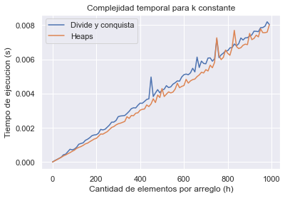

# Trabajo Práctico 1

## Integrantes:

| Nombre         | Padrón | Email               |
| -------------- | ------ | ------------------- |
| Manuel Sanchez | 107951 | msanchezf@fi.uba.ar |
| Ian Shih       | 108349 | ishih@fi.uba.ar     |

## Primera parte

### División y conquista

#### Complejidad segun Teorema Maestro

Al ser un algoritmo que hace uso del concepto de división y conquista, para calcular la complejidad podemos usar el Teorema Maestro. Para ello, debemos establecer los valores de $A$, $B$ y $C$ en la ecuacion de recurrencia de forma $T(N) = A*T(N/B) + f(N)$.

- $A$ es la cantidad de llamados recursivos. En este caso, se puede observar claramente como hay 2 llamados recursivos, uno por cada mitad del arreglo de arreglos. Consecuentemente, quedaria $A = 2$.
- $B$ es en cuanto se divide el subproblema por cada llamado recursivo. El problema es dividido en 2 por cada llamado ya que cada uno de estos recibe una mitad del arreglo de arreglos. Por lo tanto, concluimos que $B = 2$.
- $f(n)$ es el coste de las operaciones no recursivas. Estas operaciones son `split` y `merge`.

  - `split`: Su funcion es dividir el arreglo de arreglos en 2, y retornar una tupla con cada mitad. Al estar usando python, la complejidad de hacer un slice es $O(k)$, siendo $k$ la cantidad de elementos en el arreglo de arreglos, por lo cual esa es la complejidad de este algoritmo.
  - `merge`: Esta funcion se encarga de combinar 2 arreglos de numeros de forma que el orden ascendente se mantenga. Eventualmente, el algoritmo va a llegar a un punto donde va a tener 2 arreglos, cada uno con la mitad de elementos totales y tendra que combinar ambos. Este es el peor caso del algoritmo, en cuyo caso debe hacer $N$ comparaciones, siendo $N=k*h$ (con $k$ siendo la cantidad de arreglos y $h$ la cantidad de elementos por arreglo).

  En consecuencia, el coste no recursivo es $O(N)$ con $N$ siendo la cantidad de elementos totales. En este caso del Teorema Maestro, podemos buscar un valor para $C$ de forma que $O(N^C) = O(N)$. Resolviendo esta simple igualdad, llegamos a $C=1$.

Considerando todo esto, caemos en el segundo caso del Teorema Maestro, donde $A = B^C$. En conclusion, la complejidad del algoritmo segun el Teorema Maestro es $O(N^C * log(N))$ que es igual a $O(N * log(N))$. Reemplazando $N = kh$, obtenemos $O(kh * log(kh))$.

### "El algoritmo que usa heaps"

#### Descripcion

"El algoritmo que usa heaps" es un algoritmo que permite hacer un _merge_ de $k$ arreglos haciendo uso de un _min-heap_.
Para ello, sigue los siguientes pasos:

1. Insertar el primer elemento de cada arreglo en el heap. Es importante mantener un registro de a que arreglo
   pertenecia dicho elemento.
2. Extraer la raiz del heap e insertarla en un arreglo.
3. Extraer otro elemento del arreglo al que pertenecía la raiz antes de ser insertada al heap.
4. Insertar este nuevo elemento al heap.
5. Repetir desde el paso 2 hasta que no queden mas elementos en ningun arreglo.

#### Complejidad

En nuestra implementacion, dicho algoritmo esta compuesto por:

- `initialize_heap`: Esta funcion se encarga de recorrer todos los arreglos e insertar el primer elemento de cada uno de
  ellos en una lista, lo cual tiene una complejidad temporal de $O(k)$. Luego, a esta lista se le hace _heapify_ para
  transformarla en un _min-heap_, lo cual tiene la misma complejidad temporal, $O(k)$. Por ello, esta funcion tiene una
  complejidad temporal de $O(k)$.
- `push_next`: Esta funcion inserta el siguiente elemento del arreglo donde se encontraba la raiz del heap previa a ser
  insertada al mismo. Insertar un elemento a un heap, usando `heapq.heappush` tiene una complejidad de $O(log(k))$.
- `HeapElement`: Todos los metodos de esta clase tienen una complejidad de $O(1)$.
- `kmerge`: Esta es la funcion principal que se encarga de combinar multiples arreglos. Primero, llama
  a `initialize_heap` que tiene una complejidad $O(k)$. Luego entra en un `while` que itera mientras la longitud del
  arreglo resultado sea menor a la cantidad total de elementos, es decir, $k*h$ veces que es igual a $N$ veces. Dentro
  del `while`, se realizan 3 operaciones:

  - Se extrae la raiz del heap (valor minimo) usando `heapq.heappop`, el cual tiene una complejidad de $O(log(k))$.
  - Se inserta un nuevo elemento al heap usando `push_next`, el cual tiene una complejidad de $O(log(k))$.
  - Se concatena el valor minimo al arreglo de resultado, lo cual tiene una complejidad de $O(1)$.

  En total, la complejidad obtenida dentro del `while` es $O(log(k))$, y repitiendolo $k*h$ veces, resulta en una
  complejidad de $O(k h * log(k))$.

### Complejidad real de DyC




La complejidad hallada usando el teorema maestro no se condice con los graficos ya que es evidente que en el grafico de $k$ constante, ambos algoritmos poseen una forma de crecimiento casi identica. Esto es incompatible con la idea de que la complejidad del algoritmo de DyC es $O(kh * log(kh))$ ya que la complejidad del algoritmo de heaps es $O(k h * log(k))$.

Si mantenemos $k$ constante, la complejidad de los algoritmos (en teoria) deberia ser la siguiente:

- DyC: $O(h * log(h))$ segun el teorema maestro
- Heaps: $O(h)$

Al mantener $h$ constante, a pesar de haber una brecha en los tiempos de ejecucion, la forma de crecimiento parece ser la misma, lo que nos lleva a creer que la complejidad del algoritmo de DyC es erronea. Es altamente probable que la brecha se deba a el alto numero de llamadas recursivas resultantes de tener numerosos arreglos. Por cada llamado recursivo, hay un costo de operaciones no recursivas que resultan en un mayor tiempo de ejecucion.

La cantidad de llamados recursivos se da por cada par de arreglos. Es decir, unicamente se considera $k$ para determinar la cantidad de llamados recursivos. Como consecuencia, la profundidad en nivel de las llamadas recursivas es de $O(log(k))$. Luego, por cada uno de estos niveles, se realizan operaciones no recursivas que implican analizar 1 vez cada uno de los k arreglos. Esto significa, que por cada nivel de profunidad, se realiza una operacion de costo $O(N)$.

Consecuentemente, la complejidad total se podria calcular como la complejidad por nivel de profunidad de recursion multiplicado por la cantidad de niveles. En otras palabras, $O(N) * O(log(k))$, lo cual es igual a $O(N * log(k))$ o $O(kh*log(k))$.

Tambien podriamos llegar a la misma conclusion partiendo desde la ecuacion de recurrencia $T(N)=2\times T(N/2) + O(N)$.


En este punto, sabemos el trabajo que hay que hacer por llamada recursiva. Sin embargo, nos falta definir el caso base. El algoritmo propuesto tiene 2 casos base, segun la longitud del arreglo de arreglos:

- Cuando es 1: se devuelve el unico arreglo dentro del mismo, cuya complejidad es $O(1)$.
- Cuando es 2: se hace un `merge` entre los 2 arreglos. Por nivel, el costo de esto es $O(N)$ ya que requiere analizar los $h$ elementos de los $k$ arreglos.

Como la complejidad del caso del `merge` es mayor, tomaremos esa como una cota superior. Ahora podemos expresar la complejidad como una sumatoria de costos por nivel que va desde 0 hasta la cantidad de niveles ( $log(k)$ ) menos uno (ya que el primer nivel esta considerado por fuera de la sumatoria).


Resolviendo la ecuacion, nos queda la misma complejidad hallada previamente.

La razon por la cual el Teorema Maestro dio un resultado incorrecto es porque para poder aplicarlo, se deben cumplir las siguientes condiciones:

1. A es natural.
2. B es real mayor a 1, y es constante (siempre el mismo).
3. El caso base es constante.

No obstante, la tercera condicion no se cumple. Esto se debe a que, como fue mencionado previamente, hay 2 casos base distintos segun la longitud del arreglo de arreglos:

- Cuando es 1: se devuelve el unico arreglo dentro del mismo, cuya complejidad es $O(1)$.
- Cuando es 2: se hace un `merge` entre los 2 arreglos, cuya complejidad es $O(n)$, siendo $n$ la longitud de los arreglos.

Por esta razon, al aplicar teorema maestro, obtenemos un resultado incorrecto.

## Segunda parte: Problema del contrabando

### Greedy

El algoritmo greedy hace los siguientes pasos:

1. Ordenar de mayor a menor los paquetes de cada producto de la mercaderia
2. Por cada producto de la mercaderia
   1. Tomar un paquete y fijarse si alcanza para pagar todo el soborno
      1. Si alcanza, me lo guardo como optimo local. Si encuentro otro que ajuste mejor al soborno deseado, cambio el optimo local por este nuevo.
      2. Si no alcanza, lo agrego a la solucion
3. Repetir desde 1 con el siguiente producto hasta que haber pagado todo el soborno

El algoritmo es unicamente capaz de optimizar el ultimo paquete de cada producto. Si un paquete no alcanza para pagar el
soborno, se agrega a la solucion y se pasa al siguiente paquete. Es decir, cuando no alcanza, siempre toma el mas
grande. Esta es la parte donde falla y no es optimo. Sin embargo, por esta misma razon es lo que lo hace greedy, la
solucion mas "voraz" siempre va a ser la que reduzca el soborno lo mas "rapido" posible.

### Programacion dinamica

#### Descripcion general

Analizando el problema detalladamente, nos damos cuenta que es similar al problema de la mochila (y al de subset sum), aunque a diferencia de la mochila, tenemos mas de una "mochila" y no tenemos la posibilidad de dejarle menos unidades de los que nos pide el
funcionario, tenemos que darle mas o la misma cantidad. Con estas consideraciones, diseñamos el siguiente algoritmo:

Por cada producto, creamos una matriz de soluciones, donde las filas son los paquetes y las columnas son los valores del soborno para cada subproblema. Todas las celdas son incializadas en $-1$ para indicar que no existe solucion posible (o aun no fue calculada) excepto la celda en (0,0). Esta celda representa el subproblema de cuando el soborno es 0 y yo tengo 0 paquetes, por lo tanto la solucion es 0 y ese sera el valor de la celda. Esta sera la solucion inicial que va a servir para plantear las soluciones al resto de los subproblemas.

Luego:

1. Iteramos cada celda de la matriz, llenando cada una con la solucion al subproblema. Buscamos la cantidad de productos cuya diferencia con el soborno sea **minima**, considerando que debe ser mayor o igual a este. Para ello, se elige entre:
   - No usar el paquete actual. Es decir, usar la solucion del subproblema para el mismo soborno, pero usando un paquete menos.
   - Usar el paquete actual considerando el subproblema de tener un soborno igual al soborno actual menos el valor del mismo teniendo un paquete menos.
   
  En ambos casos, verificamos si la solucion al subproblema utilizado existe o no. Si no existe ninguna solucion o si ambas soluciones a los subproblemas no alcanzan para pagar el soborno, el valor de la celda queda en $-1$, indicando que ese subproblema no se puede resolver. De otro modo, se elige la solucion mas optima (que **minimice** la diferencia entre la cantidad y el soborno).

2. Se reconstruye la solucion a partir de la matriz generada al igual que en el problema de la mochila. Para ello se parte de la ultima posicion de la matriz y se recorre el arreglo de mercaderia de atras para adelante, verificando si cada paquete fue usado para llegar a la solucion al subproblema actual. Si lo fue, se agrega al arreglo de solucion, y si no, se pasa al siguiente paquete.
   + Para verificar si un paquete fue usado o no, se compara la aproximacion al soborno deseado menos la cantidad de producto en el paquete actual con la solucion al subproblema de usar un paquete menos y una cantidad de soborno deseada igual a la cantidad de soborno total menos la cantidad de producto. A diferencia del problema de la mochila, lo que puede pasar es que la aproximacion sea mayor al soborno deseado. Por lo tanto, al intentar obtener "la solucion al subproblema de usar un paquete menos y una cantidad de soborno deseada igual a la cantidad de soborno total menos la cantidad de producto" hay que realizar un ajuste para no indexar la matriz usando valore snegativos. Para ello, simplemente obtenemos el maximo entre dicha resta y 0. Es decir, si en algun momento la cantidad de producto fuera mayor al soborno deseado, para evitar compararlo con una solucion al subproblema de un soborno "negativo", se compara con la solucion al subproblema de querer un soborno de 0 productos para saber si se uso dicha solucion o no.

Este proceso se repite por cada uno de los productos dentro del soborno deseado.

La ecuacion de recurrencia del algoritmo es la siguiente:


Notar que:

- La primera expresion solo es valida si $OPT(n-1, max(s-v_i,0)) + v_i \ge s$ y $OPT(n-1, max(s-v_i,0)) \ne -1$.
- La segunda expresion solo es valida si $OPT(n-1, s) \ne -1$.

### Complejidad

Se establecen las siguientes variables:

- $n$: Cantidad **maxima** de paquetes por producto
- $k$: Cantidad de productos
- $s$: Soborno **maximo** pedido

#### Greedy

Para el algoritmo greedy, ordenamos los paquetes de mayor a menor por cada producto e iteramos a traves de ellos.

Ordenar los paquetes de cada producto cuesta $O(n * log(n))$, resultando en que la funcion `ordernar_mercaderia`
cueste $O(k n * log(n))$

Iterar los paquetes de todos los productos cuesta $O(k * n)$ debido a que las instrucciones ejecutadas en el ciclo se hacen en tiempo constante.

Esto resulta en un algoritmo con complejidad total de $T(n, k) = O(k n * log(n)) + O(k * n) = O(k n * log(n))$

Tambien se diseño el mismo algoritmo greedy, pero esta vez ordenando los paquetes de menor a mayor, para asi poder comparar el impacto que implica el orden en la optimalidad del algoritmo.

#### Dinamica

Por **cada producto**, construimos una matriz de $s$ columnas y $n$ filas, la iteramos y luego reconstruimos la solucion en base a la matriz.

Construir una matriz $s\times{n}$ cuesta $O(s * n)$, al igual que iterarla (todas las instrucciones se ejecutan en tiempo constante).

Reconstruir la solucion tiene una complejidad de $O(n)$ debido a que se recorre el arreglo de paquetes, buscando cuales se usaron y cuales no.

El algoritmo para calcular los paquetes optimos para **un producto** resulta en $T(n, s) = O(s * n) + O(s * n) + O(n) = O (s * n)$.

Esto resulta en un algoritmo con complejidad total de $T(n, s, k) = O(k * s * n)$, debido a que es polinomial respecto al valor numerico de los sobornos, la complejidad resultante es pseudopolinomial.

### Deficiencias de algoritmo greedy

Como se menciono anteriormente, al solo ser capaz de optimizar el **ultimo** paquete, en casos donde la solucion
optima **no** tiene en cuenta el paquete de mayor siempre va a fallar el algoritmo greedy

```
Ejemplo:

Cuando tengo los siguientes paquetes `[8, 6, 5]` y se pide un soborno de 11 unidades, nuestro algoritmo devolvera `[8, 5]` porque siempre se tiene en cuenta el mas grande
```

Para el algoritmo greedy de minimos, para los casos donde el paquete mayor pertenezca a la solucion optima, se va a alejar mucho del optimo. Esto es debido a que los paquetes mas pequeños se van a acercar mucho al soborno pedido, pero si no llegan, se utilizan paquetes con mayor cantidad y terminamos pagando mucho mas de lo pedido

```
Ejemplo:

Suponiendo los paquetes [5, 6, 8] y se pide un soborno de 12 unidades, el algortimo greedy por minimos eligiria los 3 paquetes
```

### Generacion de set de datos

Para la generacion de set de datos, se establece un $k$ y un $n$, por cada $k$ se crea un producto y se genera un
arreglo aleatorio de tamaño $n$, de ese arreglo se seleccionan $n // 3$ elementos que van ser nuestro soborno para ese
producto.

El resultado correcto sera el resultado donde la suma de las cantidades de los paquetes sea igual al soborno determinado
para el producto, sabemos que siempre se encontrara el optimo (para el caso de la solucion con programacion dinamica)
porque el soborno se elige del mismo arreglo.

(Definido en `utils.py`)
