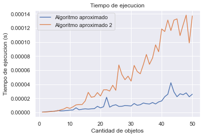

# Trabajo Práctico 1

## Integrantes:

| Nombre         | Padrón | Email               |
| -------------- | ------ | ------------------- |
| Manuel Sanchez | 107951 | msanchezf@fi.uba.ar |
| Ian Shih       | 108349 | ishih@fi.uba.ar     |

### Algoritmo de Backtracking

#### Clase de complejidad

Vamos a considerar el problema de empaquetamiento como un problema de decision. Es decir, dada una lista de objetos, se busca responder la siguiente pregunta: "¿Se puede empaquetar dichos objetos usando a lo sumo $k$ envases de tamaño 1?".

Para demostrar que un problema es NP-Completo se deben cumplir 2 condiciones:

Dado un problema $X$:

- Una solucion al problema $X$ se puede verificar en tiempo polinomial.
- Otro problema $Y$ NP-Completo se puede reducir al problema $X$, de forma que $X \ge_p Y$. Es decir, resolver $X$ es al menos tan dificil como resolver $Y$.

Analicemos si una solucion a nuestro problema se puede verificar en tiempo polinomial. Como entrada, esperamos recibir una lista de paquetes, y un valor $k$ que representa la cantidad de paquetes. Para saber si una solucion es valida, lo primero que verificamos es que la suma de objetos de cada paquete no supere 1. Una vez verificado esto, nos fijamos si la cantidad de paquetes es menor o igual a $k$. En codigo seria asi:

```py
for paquete in paquetes:
  if sum(paquete) > 1:
    return False

return len(paquetes) <= k
```

Todas estas operaciones se pueden hacer en tiempo polinomial. Consecuentemente, se cumple la primera condicion de un problema NP-Completo.

Por otro lado, proponemos reducir el problema de Subset Sum al problema de empaquetamiento. Este problema trata sobre, dado un set de numeros $S$ y un numero objetivo $n$, buscar si existe un subset de $S$ cuyos objetos sumen exactamente $n$. Por ejemplo:

```txt
S = [1, 8, 16, 4, 10, 9]
n = 15
```

Para poder reducir esto al problema de empaquetamiento, lo primero que hay que hacer es filtrar a todos aquellos numeros que sean mayores que $n$. En nuestro caso:

```txt
[1, 8, 16, 4, 10, 9] --> [1, 8, 4, 10, 9]
```

Debido a que el problema de empaquetamiento solo trabaja con numeros del 0 al 1, dividimos todos los numeros restantes por $n$.

```txt
n = 15
[1, 8, 4, 10, 9] --> [1/15, 8/15, 4/15, 10/15, 9/15] --> [0.067, 0.533, 0.267, 0.667, 0.6]
```

Luego, aplicamos el algoritmo de empaquetamiento. Si conseguimos una solucion en la que un paquete este completo (que sus objetos sumen exactamente 1), entonces significa que efectivamente existe un subset de $S$ tal que sus objetos sumen $n$.

Ejemplo del algoritmo de reduccion

```py
def reducir_a_objetos(set, n):
  nuevo = []
  for elem in set:
    if elem > n: continue
    nuevo.push(elem / n)
  return nuevo
```

#### Complejidad temporal

Con el fin de simplificar el analisis, consideraremos a nuestro algoritmo de _backtracking_ como si fuera un algoritmo de _fuerza bruta_, es decir, que no realiza ningun tipo de poda del arbol de llamados recursivos con el fin de acelerar la velocidad de ejecucion. La complejidad real del algoritmo de _backtracking_ va a ser similar a la obtenida gracias al analisis (mas/menos ciertas constantes).

La peor solucion posible, es decir, la que mas paquetes ocupe será la que tenga un objeto por paquete. Por lo tanto, la cantidad total de paquetes seria $n$, siendo esta la cantidad de objetos a empaquetar. Es por ello que proponemos que, inicialmente, el algoritmo crea los $n$ paquetes en donde intentara almacenar los $n$ productos. No necesariamente se usaran los $n$ paquetes, pero de esta forma se contemplan todas las soluciones (la cantidad de paquetes es siempre menor o igual a la cantidad de productos).

El algoritmo de _fuerza bruta_ prueba todas las combinaciones posibles, incluso las que son invalidas (las que contienen paquetes cuyos objetos sumen mas de 1). La cantidad de llamados recursivos sera igual a las combinaciones posibles de soluciones. Por ejemplo, si tenemos:

```txt
S = [0.1, 0.2, 0.3]
```

Entonces, las soluciones posibles se ven algo asi:

```txt
[[0.1, 0.2, 0.3], [], []]
[[0.1, 0.2], [0.3], []]
[[0.1, 0.2], [], [0.3]]
[[0.1, 0.3], [0.2], []]
[[0.1], [0.2, 0.3], []]
[[0.1], [0.2], [0.3]]
[[0.1], [], [0.2, 0.3]]
[[0.2, 0.3], [0.1], []]
...
[[], [], [0.1, 0.2, 0.3]]
```

Cada elemento puede ir en $n$ paquetes distintos. Al tener $n$ objetos, la cantidad total de combinaciones es $n^n$. Debido a que el algoritmo prueba todas las combinaciones posibles y las operaciones que hace (sin considerar la recursion) se resuelven en $O(1)$, podemos concluir que el algoritmo tiene una complejidad de O($n^n$)

### Algoritmo aproximado

#### Complejidad temporal

La complejidad temporal del algoritmo aproximado de la catedra es $O(N)$. Esto se debe a que hay un unico ciclo `for` que recorre la lista de objetos. Si un objeto no entra en el paquete actual, se cierra el paquete y se agrega a la lista de paquetes, luego se crea un paquete nuevo e inserta el objeto alli. Gracias a esta simple logica, el algoritmo solo recorre la lista de paquetes una vez, resultando en la complejidad mencionada.

#### Analisis de aproximacion

Para calcular la cota $r(A)$ para nuestro algoritmo de aproximacion, se consideraran los siguientes puntos:

- $A(I)$ es la cantidad de paquetes generados por nuestro algoritmo de aproximacion
- $z(I)$ es la cantidad de paquetes generados por nuestro algoritmo optimo

La suma de los objetos de 2 paquetes adyacentes es superior a 1. Esto es debido a que si se creo un paquete nuevo, necesariamente el primer objeto del nuevo paquete no entraba en el paquete anterior. Sea $P_i$ la suma de los elementos del paqute $i$, tenemos que:

$$
P_i + P_{i+1} > 1
$$

A raiz del ultimo punto, deducimos que la suma de los objetos de todos los paquetes es mayor a $\frac{A(I)}{2}$. Esto se puede ver gracias a que:

$$
P_1 + P_2 > 1
$$

$$
P_3 + P_4 > 1
$$

$$
P_5 + P_6 > 1
$$

$$
\vdots
$$

$$
P_{A(I)-1} + P_{A(I)} > 1
$$

Al sumar todas las desigualdades, obtenemos que:

$$
\sum_{i=1}^{A(I)} P_i > \frac{A(I)}{2}
$$

Asimismo, sabemos que el mejor empaquetamiento posible es aquel en el cual los elementos llenan todos los paquetes de forma perfecta. Esta es la mejor solucion a la que puede llegar el algoritmo optimo. Sea $x_i$ el valor del objeto $i$, y $n$ la cantidad total de objetos:

$$
z(I) \ge \sum_{i=1}^{n} a_i = \sum_{i=1}^{A(I)} P_i
$$

Con todo lo planteado anteriormente, llegamos a la siguiente inecuacion

$$
z(I) \ge \sum_{i=1}^{n} a_i  > \frac{A(I)}{2}
$$

Por lo tanto:

$$
z(I) \ge \frac{A(I)}{2} \Rightarrow \frac{A(I)}{z(I)} \le 2 = r(A)
$$

En conclusion, el algoritmo provisto es una 2-aproximacion de la solucion optima.

### Algoritmo aproximado 2

Para nuestro algoritmo aproximado 2, se hacen los siguientes pasos:

- Se ordena de mayor a menor la lista de objetos:
- Por cada objeto, nos fijamos si entra en algun paquete:
  - Si entra lo agregamos, y pasamos al siguiente objeto.
  - Si no entra en ningun paquete, se crea un paquete nuevo, se agrega el objeto y pasamos al siguiente objeto.

#### Complejidad temporal

La complejidad temporal de este algoritmo es $O(n^2)$. Esto se debe a que el peor caso posible es aquel en el que cada objeto ocupa un paquete entero. Por lo tanto, cada objeto al ser insertado debe pasar por cada paquete probando si entra o no. Al tener $n$ paquetes y $n$ objetos, la complejidad final es $O(n^2)$.

Debido a que la complejidad de la insercion de los objetos en los paquetes es mayor a la complejidad de ordenar los paquetes de mayor a menor (la cual es $O(n log n)$ ), esta no afecta a la notacion Big-O del algoritmo.

### Comparaciones de optimalidad

Ejecutando el archivo `optimalidad.py` observamos los siguientes numeros

Algoritmo aproximado:

- Error relativo promedio: 17.6471%
- Maximo r(A): 1.5714
- Promedio r(A): 1.1764

Algoritmo aproximado 2:

- Error relativo promedio: 0.1206%
- Maximo r(A2): 1.25
- Promedio r(A2): 1.0012

A partir de esto podemos sacar las siguientes conclusiones

- La cota calculada para el algoritmo aproximado se cumple ya que el maximo $r(A)$ calculado es menor a 2.
- A pesar de ser una 2-aproximacion, la solucion obtenida por el algoritmo aproximado es, en promedio, tan solo un 17% mayor a la solucion optima.
- El algoritmo aproximado 2 obtiene mejores resultados que el algoritmo aproximado 1, al obtener un menor error relativo y un menor $r(A2)$.

### Comparaciones de tiempos de ejecucion


En el grafico, es posible observar como la forma de crecimiento del algoritmo optimo es mucho mas elevada que la de los algoritmos aproximados, los cuales apenas pueden ser observados como una linea horizontal sobre el eje. Esto es un claro indicio del crecimiento exponencial que presenta el algoritmo optimo, a diferencia de las complejidades polinomiales que tienen las aproximaciones. El crecimiento exponencial implica que, al agregar mas elementos, el tiempo de ejecucion aumente de forma muy elevada.

Debido a que la complejidad del algoritmo optimo es muy alta, no es posible discernir las formas de crecimiento de cada algoritmo. Por lo tanto, decidimos realizar un grafico solo con los algoritmos mas "veloces", es decir con las aproximaciones, de forma que podamos compararlas entre ellas.



En este grafico es mas facil diferenciar las curvas de los algoritmos aproximados. Podemos ver que la curva naranja, perteneciente al algoritmo aproximado 2, crece mas rapidamente que la curva azul, del algoritmo aproximado 1 (el provisto por la catedra).

Esta diferencia se debe a que el algoritmo aproximado 2, tiene una complejidad de $O(n^2)$, mientras que la del algoritmo aproximado 1 es $O(n)$. Es decir, el tiempo de ejecucion del algoritmo 2 crece de forma cuadratica, mientras que el del algoritmo 1 es lineal, resultando en esta diferencia marcada en la forma de crecimiento.
